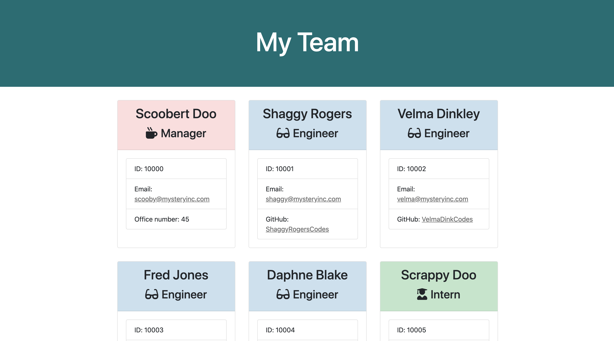

# Team-Generator

A node CLI that generates an employee summary page for a software engineering team. 

## Description
The application prompts the user for information about the team members including the manager, engineers, and interns. Each employee type has specific information to be answered, such as an office number for a manager, or a school name for an intern. When the user has completed inputing all team members, the application creates an HTML file that displays their team roster based on their inputs, including a display of all relevant information and a color-coding system based on the employee's role. This application requires the installation of the dependency inquirer.

## Video Walkthrough
View a walkthrough of this application in action at <https://www.youtube.com/watch?v=ULEuBXI1SH0&feature=youtu.be>

## Other Work
You can see some of my other work at <https://github.com/kimcredit>.    
